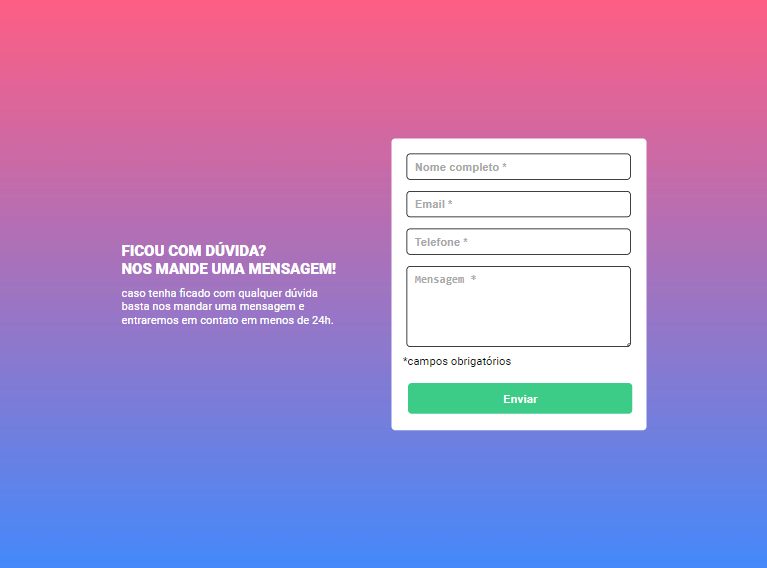
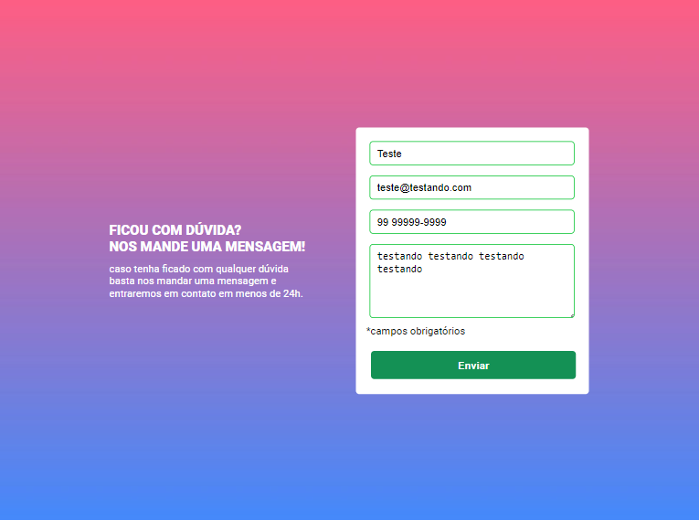

# Quest-HTML-CSS-JS-Intemediário
Esta é uma solução para a Quest proposta pelo curso DevQuest do @devemdobro, com o intuito de aprimorar e desenvolver tanto o seu Javascript quanto o HTML e CSS.

# Desafio 
 criar um formulário com validação de dados :
<ul>
    <li>A validação do formulário deve ser feita com javascript puro.</li>
    <li>Ao clicar para enviar o formulário, se caso algum campo não estiver preenchido, a borda do input deve ficar vermelha e uma mensagem de "campo obrigatório" deve aparecer embaixo do campo que não foi preenchido.</li>
    <li>O fundo do formulário deve ser feito usando a imagem em anexo na aula.</li>
</ul>

# Previsualizção do projeto 👀
## Desktop 💻

## Mobile 📱

# Tecnologias utilizadas 🚀
<ul>
    <li>HTML 5</li>
    <li>CSS</li>
    <li>JavaScript</li>
</ul>

# Links
<ul>
    <li><a href="https://deivid-rodrigues.github.io/formulario-com-validacao-de-dados/">GitHub Pages:</a></li>
    <li><a href="https://github.com/deivid-rodrigues/formulario-com-validacao-de-dados">Repositório</a></li>
</ul>